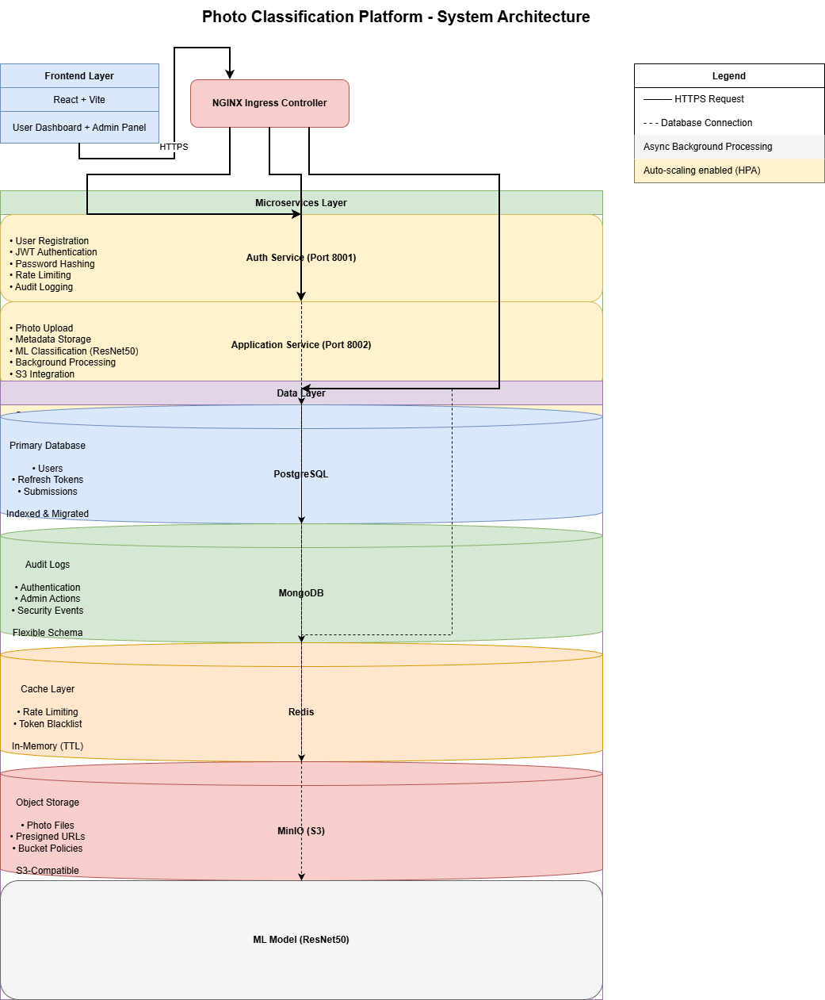
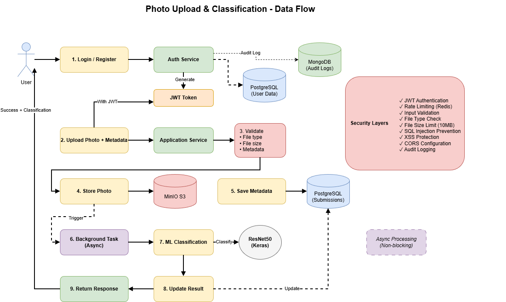

# Architecture

## System Overview

The platform follows a **microservices architecture** with three backend services, a React frontend, and shared infrastructure.

## Microservices

| Service | Port | Responsibility | Database Access |
|---------|------|----------------|-----------------|
| **Auth** | 8001 | Registration, login, JWT, profiles | PostgreSQL (users, tokens), Redis (blacklist, rate limits), MongoDB (audit) |
| **Application** | 8002 | Photo upload, storage, ML classification | PostgreSQL (submissions), MinIO (photos), Redis (rate limits), MongoDB (audit) |
| **Admin** | 8003 | Filtering, analytics, audit logs, export | PostgreSQL (submissions, read-only), MongoDB (audit logs), Redis (rate limits) |
| **Frontend** | 3000 | React SPA via Nginx | — |

## Data Flow

1. User registers/logs in via Auth Service → receives JWT
2. User uploads photo + metadata via Application Service → stored in PostgreSQL + MinIO
3. Background task classifies photo (ResNet50) → results saved to submission record
4. Admin queries submissions via Admin Service → filters, exports, views audit logs

## Design Patterns

| Pattern | Usage |
|---------|-------|
| **Repository** | Data access layer (`user_repository`, `submission_repository`) |
| **Service Layer** | Business logic separated from route handlers (`auth_service`, `submission_service`) |
| **Dependency Injection** | FastAPI `Depends()` for DB sessions, auth, audit logger |
| **Singleton** | `StorageClient`, `ImageClassifier`, `AuditLogger` |
| **Background Tasks** | Async ML classification via `BackgroundTasks` |

## Database Choices

| Database | Purpose | Justification |
|----------|---------|---------------|
| **PostgreSQL 16** | Users, submissions, refresh tokens | ACID transactions, UUID PKs, JSONB for classification results, async driver (`asyncpg`), B-tree + GIN indexes |
| **MongoDB 7** | Audit logs | Schema-flexible documents for heterogeneous event types, TTL indexes for log rotation, append-optimized writes |
| **Redis 7.2** | Rate limiting, token blacklist | Sub-millisecond reads on every request, TTL-based expiration matches token lifetimes |
| **MinIO** | Photo storage | S3-compatible API for seamless migration to AWS S3 or GCS in production |

## Schema Design

### PostgreSQL

**`users`** — `id` (UUID PK), `email` (unique), `username` (unique), `hashed_password`, `role`, `is_active`, `created_at`, `updated_at`

**`refresh_tokens`** — `id` (UUID PK), `user_id` (FK → users), `token` (unique), `expires_at`, `is_revoked`, `created_at`

**`submissions`** — `id` (UUID PK), `user_id` (indexed), `name`, `age`, `gender`, `location`, `country`, `description`, `photo_filename`, `photo_path` (unique), `photo_size`, `photo_mime_type`, `classification_status` (indexed), `classification_results` (JSONB), `classification_error`, `classified_at`, `created_at` (indexed), `updated_at`, `is_deleted` (indexed)

### MongoDB
**`audit_logs`** — `timestamp`, `event_type`, `user_id`, `action`, `ip_address`, `user_agent`, `metadata` (flexible), `status`

### Redis
- `rate_limit:{prefix}:{path}:{ip}` — Counter with TTL
- `blacklist:{jti}` — Token blacklist entry with TTL matching token expiry

### Migrations
Alembic manages PostgreSQL schema for Auth and Application services. Admin Service shares the Application database (read-only) and has no migrations of its own.

## Security Layers

See [SECURITY.md](SECURITY.md) for full details.

1. **JWT Authentication** — 15-min access tokens, 7-day refresh tokens with rotation
2. **Token Blacklisting** — Redis JTI blacklist on logout
3. **Rate Limiting** — Per-IP Redis counters (configurable per endpoint)
4. **Input Validation** — Pydantic schemas, password strength, reserved usernames
5. **RBAC** — Admin role enforcement via `get_current_admin` dependency
6. **Audit Trail** — MongoDB event log for all critical actions
